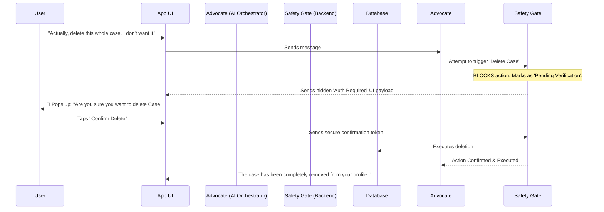

# Concept & Acceptance Criteria

## 1. The Core Idea: Original vs. New

### The Original Idea (Fragmented Chat)
Previously, the user had to explicitly choose how they interacted with the app. They either talked to the "ChatBot" for general law questions, went to a separate flow to build a case, or toggled into a "Case Agent" mode to modify facts. The AI was blind to the bigger picture—it couldn't fluidly transition between answering a simple question, asking for missing case details, and dynamically deciding to update the case file itself.

### The New Idea (The Universal Advocate)
The new system acts like a single, unified Legal Advocate that sits right next to the user. The user just talks. 
Behind the scenes, the Advocate automatically understands what needs to happen. If the user asks a question, it searches the law. If the user mentions a new fact, it seamlessly updates the case file. If the user asks to do something drastic (like deleting their case), the Advocate stops, prepares the action, and asks the user for a final, manual confirmation. The entire experience happens in one continuous, magical chat stream.

---

## 2. Information Flow Diagrams

### Flow 1: The Seamless Intake & Execution Loop
This illustrates how the Universal Advocate handles normal, safe actions (like adding a fact or searching the law) without breaking the conversation.

```mermaid
sequenceDiagram
    participant User
    participant App UI
    participant Advocate (AI Orchestrator)
    participant Sub-Agents (Law Search, Case Builder)
    participant Database

    User->>App UI: "I also want to add that the officer didn't read my rights."
    App UI->>Advocate: Sends message
    
    Note over Advocate: Analyzes intent: User is adding a fact to an active case.
    
    Advocate->>Sub-Agents: Delegates to Case Builder Agent
    Sub-Agents->>Database: Saves new fact to case file
    Sub-Agents-->>Advocate: Fact saved successfully
    
    Note over Advocate: Switches to Law Search to find relevant rights violation rules.
    
    Advocate->>Sub-Agents: Delegates to Law Search Agent
    Sub-Agents-->>Advocate: Returns criminal procedure laws
    
    Advocate->>App UI: Streams response: "I've added that to your case facts. Under Article X, this is a major procedural violation..."
    App UI->>User: Reads seamless response
```

### Flow 2: The Dangerous Action Protocol (User Verification)
This illustrates what happens when the AI tries to do something destructive (deleting a case or spending money). The AI is literally locked out of the database until the user physically taps a button.



---

## 3. User Perspective Acceptance Criteria

- [ ] **Invisible Routing**: The user never has to select "Modes" (like Intake mode vs Chat mode). They just type, and the AI perfectly understands whether they are asking a hypothetical question, building a case, or updating facts.
- [ ] **Unbreakable Experience**: The AI never spits out broken text, "JSON errors", or suddenly crashes the chat. If the AI gets confused internally, it automatically fixes itself before the user ever sees a response.
- [ ] **Proactive Advocate**: If the user is missing critical facts for their case, the AI naturally pivots the conversation to ask for them, instead of waiting for the user to figure it out.
- [ ] **Absolute Control & Safety**: The AI can write notes and add facts freely to save the user time. However, if the AI attempts to delete a case, remove an argument, or take any action that loses data, the UI immediately pops up a red warning box demanding the user manually tap "Approve" before the action happens.
- [ ] **UI awareness**: The AI can pull up relevant UI components inside the chat. If it thinks the user needs to see their Case Summary, it generates a beautiful summary card right in the chat feed instead of just dumping a wall of text.
