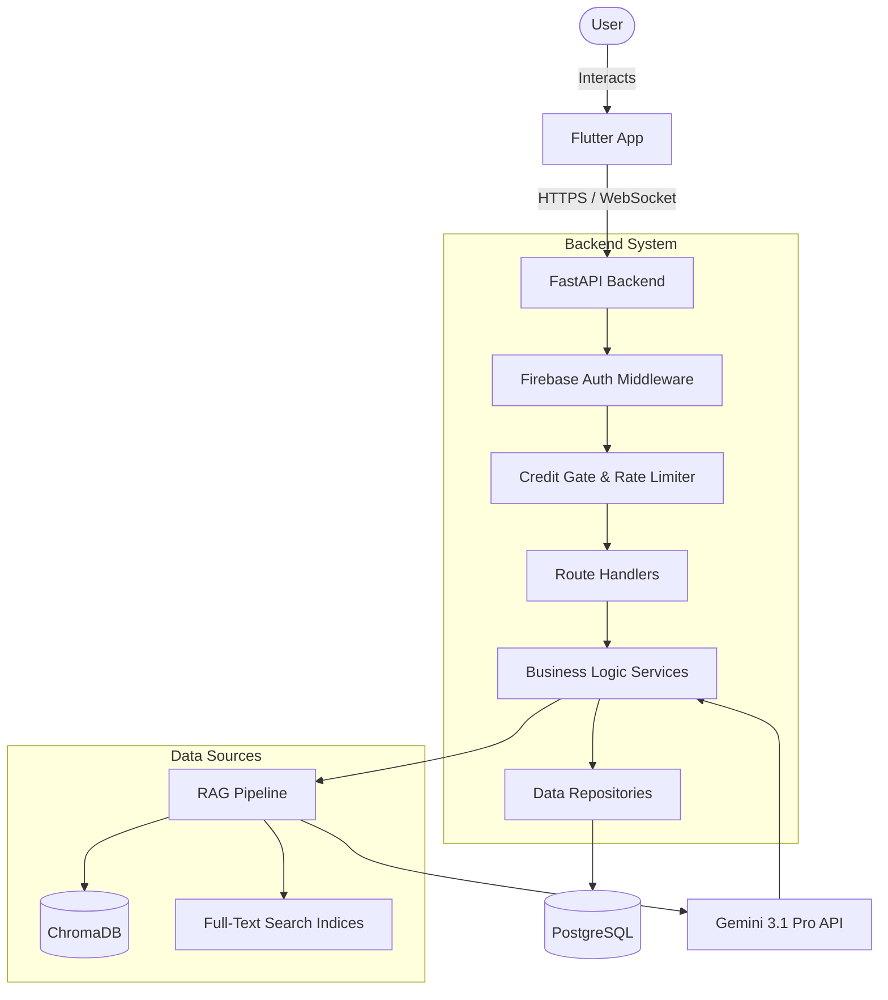
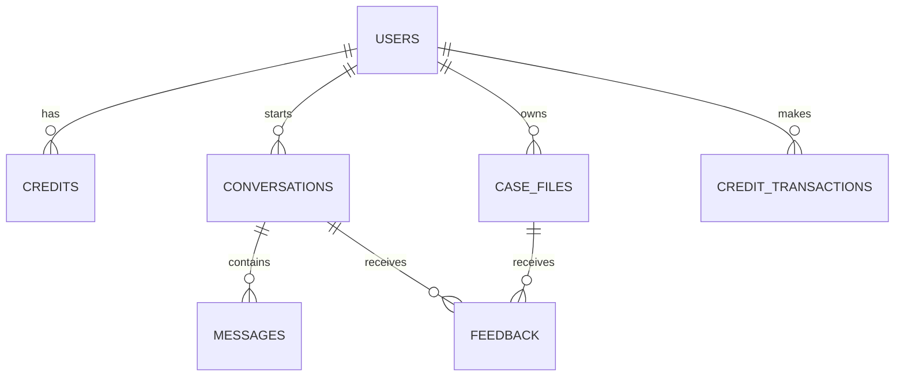

# Architecture Overview

> High-level system design and decisions for The Master of Law.

## System Diagram

## Data Flow

1. **User Request**: The user submits a query or builds a case via the Flutter App.
2. **Flutter App**: Sends an HTTP request or WebSocket message to the FastAPI backend, including a Firebase ID token and a `rag_config` (to specify which collections to search).
3. **Backend Middleware**: Validates the Firebase token, checks the user's credit balance (Credit Gate), and applies rate limiting based on their tier.
4. **RAG Pipeline**: 
   - Expands the query.
   - Searches vector and full-text databases.
   - Merges and reranks the results.
5. **LLM Generation**: The backend sends the user query, retrieved context, and source-specific instructions to Gemini 3.1 Pro.
6. **Response**: The LLM output is parsed, citations are verified, and the response is streamed or sent back to the Flutter App.

## Backend Layer Architecture

The backend follows a strict layered architecture:

- **Routes (`routes/`)**: Very thin layer. Handles HTTP request parsing, validation, and passes data to services.
- **Services (`services/`)**: Contains all business logic (e.g., RAG logic, credit deductions, LLM interactions).
- **Repositories (`repositories/`)**: Handles all database interactions (SQLAlchemy queries). Services call repositories to get/save data.
- **Models (`models/`)**: Defines the PostgreSQL database schema using SQLAlchemy ORM.

## Database Schema

The PostgreSQL database contains 7 core tables:

1. `users`: Stores user profiles and Firebase UIDs.
2. `credits`: Tracks user credit balances and tiers (FREE, PRO, ADMIN).
3. `credit_transactions`: Ledger of credit usage.
4. `conversations`: Chat sessions (gated by state machine phases).
5. `messages`: Individual chat messages.
6. `case_files`: User-generated legal cases (9 sections).
7. `feedback`: User feedback on conversations or cases.

## RAG Pipeline (5 Stages)

The core feature of The Master of Law is its highly accurate Retrieval-Augmented Generation pipeline:

1. **Stage 0 (Query Expansion)**: Gemini is used to expand the user's query into 5-10 formal Georgian legal terms.
2. **Stage 1 (Vector Search)**: Multi-query search against ChromaDB using `gemini-embedding-001`. Retrieves top-50 results per query across the selected collections.
3. **Stage 2 (Full-Text Search)**: Fallback/supplemental search using JSON indices for exact matches.
4. **Stage 3 (Merge & Deduplicate)**: Combines results from vector and full-text searches, removing duplicates based on `chunk_id`.
5. **Stage 4 (Rerank)**: Uses Gemini to rerank the merged context and select the top 20 most relevant chunks.

This context is then injected into the final LLM prompt, along with source-specific instructions (e.g., "Grand Chamber decisions are binding").

## Vector Store (ChromaDB)

We use ChromaDB with 3 distinct collections, configurable per request via `RAGCollectionConfig`:
- `georgian_laws` (15,338 chunks): 12 primary legal codes.
- `court_practice` (5,197 chunks): Supreme Court rulings.
- `grand_chamber` (177 chunks): Binding Grand Chamber decisions.

For more details on the legal data, see [LAW_CORPUS.md](LAW_CORPUS.md).

## Credit System

To manage LLM costs, the system uses a credit-based approach:
- **FREE Tier**: 5 credits/day (auto-reset), 5 requests/minute.
- **PRO Tier**: Purchased credits, 30 requests/minute.
- **ADMIN Tier**: 10,000 credits, 120 requests/minute (used for internal testing and dev).

Actions cost different amounts:
- Sending a chat message = 1 credit
- Analyzing a document = 2 credits
- Building a full case file = 3 credits

## Authentication

We use Firebase Authentication:
1. Flutter app authenticates with Firebase.
2. Obtains a JWT ID token.
3. Sends token in the `Authorization: Bearer <token>` header.
4. FastAPI `firebase_auth_middleware` verifies the token and injects the `current_user` into the request state.

## Decision Logs

- **Why FastAPI?** Fast, native async support (crucial for LLM streaming and parallel DB queries), and automatic OpenAPI documentation.
- **Why ChromaDB?** Lightweight, runs locally, easily embeddable, and sufficient for our scale (20k chunks).
- **Why Gemini 3.1 Pro?** Superior context window, natively understands Georgian language nuances, and tightly integrated with Vertex AI for structured outputs.
- **Why case-centric design?** To focus the product on tangible utility. We want to help users build actionable legal cases, not just act as a legal search engine.
