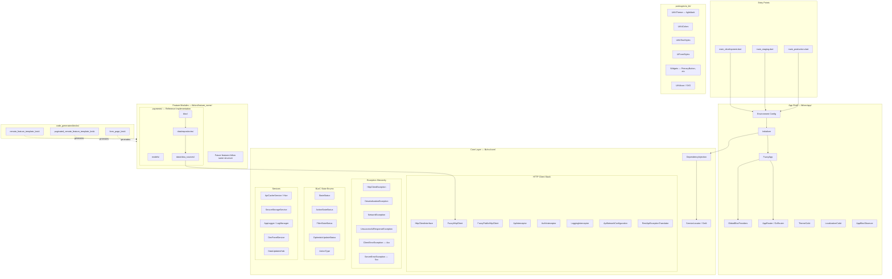
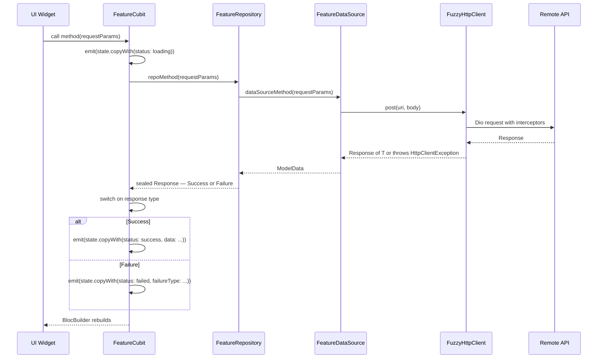

# Flutter Architecture & Standards Guide

> This is the canonical, production-grade architecture and standards document. All AI personas MUST adhere to these rules without exception. This is the single source of truth for "how we build things."

---

## 1. High-Level System Design

### Visual Map — System Architecture


### Data Flow — Feature Request Lifecycle


---

## 2. Directory Structure & Module Responsibilities

This is the canonical directory map. The AI must create files and features that fit perfectly within this structure.

```
fuzzy_starter/
├── lib/
│   ├── main_development.dart
│   ├── main_staging.dart
│   ├── main_production.dart
│   └── src/
│       ├── src.dart                  # Root barrel
│       ├── app/                      # App Shell: Routing, Theme, Globals, Init
│       ├── core/                     # Core Layer: DI, HTTP, Exceptions, Services
│       └── features/                 # Feature Modules (e.g., payments/)
├── packages/
│   └── ui_kit/                     # Design System Package
├── code_generators/bricks/         # Mason Code Generation Templates
└── ...
```

---

## 3. Feature Folder Structure (Canonical Pattern)

Every feature module MUST follow this structure. This is non-negotiable.

### 3.1. Layers within a Feature (`lib/src/<feature_name>/`)
-   **`models/`**: Plain Dart data classes with `toMap`/`fromMap`. Naming: `<Name>Data` for responses, `<Name>RequestParameters` for requests.
-   **`data/`**:
    -   `data_sources/`: Handles raw data fetching (HTTP calls). Accesses `sl.get<FuzzyHttpClient>()`.
    -   `repositories/`: Facade over data sources. **MUST** catch all exceptions and return a Sealed Class response. Takes data source via constructor injection.
-   **`bloc/`**: Cubits/Blocs and their immutable State classes. Takes repository via constructor injection. State file uses `part of`.
-   **`view/`**: `pages/` (route destinations) and `components/` (feature-specific widgets).

### 3.2. Barrel Files & `./exp.sh` (MANDATORY)
Every directory MUST have a barrel file (`<dir_name>.dart`) that exports its children. After creating any new `.dart` files, the user **MUST** be reminded to run `./exp.sh` to automatically update this entire barrel chain. Failure to do so will result in compilation errors.

---

## 4. Architectural Patterns & Rules

### 4.1. BLoC/Cubit & Repository Contract
-   **Repositories NEVER throw exceptions.** They return Sealed Classes (`Success | Failure`). This is the most important rule.
-   **Cubits NEVER use `try/catch`.** They use exhaustive `switch` on the sealed response.
-   **State MUST be immutable.** Use `copyWith`.
-   State status is tracked via `StateStatus` enum (`initial`, `loading`, `success`, `failed`).

### 4.2. Dependency Injection (GetIt)
-   **Constructor Injection is MANDATORY** for Repositories and Cubits.
-   **Service Locator (`sl.get<T>()`) is ONLY permitted** in the `data_sources/` layer (for `HttpClient`) and at the top level when providing a BLoC. It is forbidden in Widgets, Repositories, and Cubits.

### 4.3. UI Kit & Theming
-   **NEVER** use `Color()`, `Colors.`, `TextStyle()`, or hardcoded numbers for spacing/padding.
-   **ALWAYS** use theme extensions from the `BuildContext`: `context.uiColors`, `context.uiTextStyles`, `context.uiFormStyles`.
-   **ALWAYS** prefer widgets from the `ui_kit` package (`PrimaryScaffold`, `PrimaryButton`) over native Flutter widgets.

### 4.4. Error Handling Protocol
1.  **HTTP Client Level:** The `FuzzyHttpClient` and its `RestApiExceptionTranslator` automatically convert `DioException`s into a rich hierarchy of typed `HttpClientException`s.
2.  **Data Source Level:** Data sources make HTTP calls. They may let these typed exceptions bubble up.
3.  **Repository Level:** The repository wraps the data source call in a `try/catch` block. It catches ALL exceptions and translates them into a `Failure` object within its sealed response.
4.  **Cubit Level:** The cubit receives the `Failure` object and maps it to a `StateStatus.failed` state, passing along a specific `FailureType` enum.
5.  **UI Level:** The UI uses a `StatusBuilder` widget to react to `StateStatus.failed` and displays an appropriate error message based on the `FailureType`.

---

## 5. Code Generation & Scripts

The AI should prefer using scripts over manual creation.

-   **`./gen.sh <brick_name>`**: Use Mason to scaffold entire features (`remote_feature_template_brick`), pages (`form_page_brick`), etc.
-   **`./exp.sh`**: Mandatory after creating any new file.
-   **`./loc.sh "Text||lang||Translation"`**: Add localizations. No hardcoded user-facing strings.
-   **`./add_icon.sh path/to/icon.svg icon_name`**: Add SVG icons to the `ui_kit`.

---

## 6. Linter & Formatting
The project uses `very_good_analysis` with some disabled rules for practicality (e.g., 80 char line limit). The [REVIEWER] persona must run `fvm flutter analyze` and `fvm dart format --set-exit-if-changed .` as part of its process.
